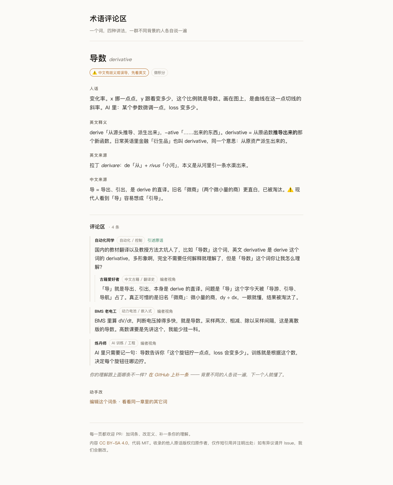

# 人话术语

**一个词，几种讲法，一群不同背景的人各自说一遍。**



教材给每个术语一个定义。看懂那个定义，靠的是运气——它假设你已经有某个领域的手感。
这里换成另一套办法：同一个词，让不同背景的人各讲一遍。

- 导数：写过 BMS 的人说「采样两次、相减、除以间隔，判断电压掉得多快」。
- 卷积：搞自动化的人说「瞬时行为的持续性结果」。
- 注意力：搞数据库的人说「Q 是查询条件，K 是索引，V 是内容，软查表」。

看得懂其中一条就够。**「跟我差不多的人懂了」本身是最强的信号**——它给你一个正向预测：
人是可以理解的，所以我也可以。

## 一条术语长什么样

每个词一个 markdown 文件，四段正文 + 一个评论区：

| 段 | 内容 |
|---|---|
| 人话 | 它到底是什么、用来干嘛 |
| 英文释义 | 拆英文字面意思（derive「推导出来」→ derivative「推导出来的东西」） |
| 英文来源 | 词根从哪来 |
| 中文来源 | 中文字怎么来的、译得准不准 |
| 评论区 | 不同背景的人各自的讲法，可嵌套回复 |

标题后带一个标记：

- ✅ 中文其实准，知道字的本义就懂
- ⚠️ 中文有歧义或误导，先看英文
- 🔁 两边都不直观，只能记住它指什么

## 目录结构

```
terms/<章节>/<英文名>.md      一个词一个文件，正文 + 评论区
templates/                    站点模板（style.css 换肤就改这一个）
site.yaml                     站名、仓库地址、章节顺序
tools/import_obsidian_note.py 一次性迁移脚本（从 Obsidian 笔记拆出词条）
tools/build_site.py           生成静态站点，只依赖 Python 标准库 + pyyaml
docs/                         已发布的那一份（构建产物，别手改）
assets/                       README 里用的图
_site/                        本地预览产物，不提交
```

投稿时**只改 `terms/` 和 `templates/`**，别碰 `docs/` ——那个目录每次构建都会被整体覆盖。

## 本地预览

```bash
pip install pyyaml
python3 tools/build_site.py
open _site/index.html        # 或者 python3 -m http.server -d _site 8000
```

没有 node、没有 npm、没有数据库。一个 pyyaml 就够。

## 怎么参与

三种，按投入从小到大：

1. **补一条你的理解**（最想要这个）。开一个 Issue，用「补一条理解」模板：说清你的背景 + 你怎么理解这个词。哪怕只是一句「我是做 X 的，我们那边管它叫 Y」。
2. **改一个定义**。直接 PR 改 `terms/` 下的某个文件。
3. **新加一个词条**。复制任意一个已有文件当骨架，改内容。

合并规矩：**任何一条评论都必须是真人真说的**。引述别人的话要标出处链接；自己写的标「编者视角」。
这条线不能糊——这个项目全部的力量来自「说话的人是真存在的」。

## 现在的家底（诚实交代）

首版 43 个词条、70 条评论，从一份个人笔记迁移过来：

- **4 条是引述真实原话**（标「引述原话」，出处待补，欢迎帮忙补链接）。
- **其余 66 条是编者视角**，由项目发起人和 AI 一起写的不同背景的讲法。
- 它们不是假托真人，但也不是真人投稿。**目标是一条一条换成真实投稿**。

引述的原话如果本人不愿意被收录，开个 Issue，我们会删掉。

## 未来

- 站点上挂 GitHub Discussions（giscus），投票用 reaction，热度高的评论由维护者提进文件层。
- 采集「优质理解」只用来找线索，入库必须带出处。
- 章节从数学与机器学习往外扩。

## 许可

- 内容（`terms/` 下的文字）：[CC BY-SA 4.0](https://creativecommons.org/licenses/by-sa/4.0/deed.zh)。拿去用、改了再发都行，改了要同样开源。
- 代码（`tools/`、`templates/`、CI）：MIT。
- 收录的他人原话版权归原作者，本站只做短引用并注明出处。

## 姊妹项目

- **会说话的定律**（descriptive-naming）：给人名定律取描述式新名，一眼听懂内容。同一套想法用在「命名」上。
  仓库还没公开，等这份稳定了一起放出来。
